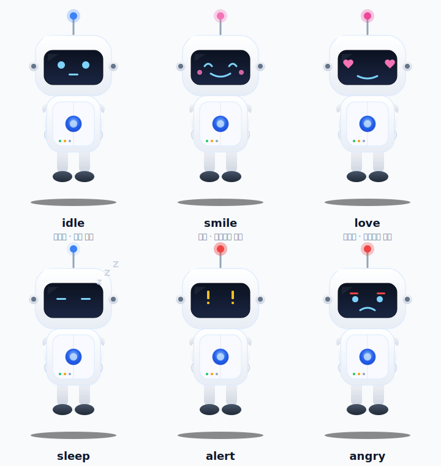

# Work-Pet: Orbit 🐾

> 화면 한구석에 조용히 머무는 데스크톱 펫 비서 — Gmail · Google Calendar 알림과 일상 도구를 한 마리에 담았습니다.

Tauri 2 기반의 가벼운 네이티브 앱으로, 화면 위를 자유롭게 걸어 다니는 작은 펫 캐릭터가 새 메일·일정·임박한 마감을 알려주고 번역·요약·캡처 같은 자주 쓰는 도구를 한 번의 클릭으로 제공합니다.

---

## 핵심 철학 — 방해하지 않는다

펫 창은 투명·테두리 없음·작업표시줄 비표시로 만들어져 작업 흐름을 가리지 않습니다. macOS에서는 모든 데스크톱(Space)에 항상 떠 있어 가상 데스크톱을 전환해도 따라옵니다. 알림이 들어오면 펫이 살짝 반응하고, 클릭해야 비로소 패널이 열립니다.

---

## 주요 기능

### 🔔 알림 & 브리핑
- **자동 폴링**: 30초마다 Gmail 신규 메일(History API 기반 델타 감지)과 Google Calendar 신규/임박 일정을 확인합니다. 캘린더는 primary뿐 아니라 사용자의 Google 캘린더 UI에 켜져 있는 보조·공유 캘린더까지 모두 묶어서 조회하므로, 회사 캘린더·팀 공유 캘린더의 일정도 동일하게 알람·브리핑에 잡힙니다.
- **시스템 알림 + 상세 말풍선**: OS 네이티브 알림과 함께 펫이 alert 상태로 전환되어 어떤 메일(`✉️ 발신자: "제목"`) / 어떤 일정(`📅 "제목" 10분 후 시작해요!`, `📅 새 일정 "제목" — 12/3 14:00`)인지 말풍선으로 직접 알려줍니다.
- **알람 패널**: 펫을 클릭해 알람 탭에서 항목을 하나씩 처리하면 카운트가 줄어들고, 모두 비우면 자동으로 idle 상태로 돌아갑니다.
- **수동 브리핑**: 브리핑 탭에서 오늘 일정을 한눈에 조회하거나 트레이의 "브리핑 새로고침"으로 강제 갱신합니다.
- **🪟 위젯 모드** (트레이 토글): ON으로 두면 펫이 평소엔 숨어 있다가 알림(브리핑·정기/휴식 알림)이 올 때만 화면 **우하단**에서 튀어 오르듯 등장해 말풍선을 띄우고 자동으로 사라집니다. 등장 시 가볍게 회전·바운스하며 `jump → wave` 동작을 보여주고, 머무는 동안에는 위아래로 살짝 흔들립니다. 메시지 길이에 따라 6~15초간 머무르며, 펫·말풍선을 클릭하거나 더블클릭하면 즉시 닫힙니다. 동시에 여러 알림이 도착하면 차례로 보여줍니다(최대 5건). Windows에서는 `GetMonitorInfoW(rcWork)`로 작업표시줄을 가리지 않는 우하단을, macOS에서는 화면 우하단을 기준으로 잡습니다. 모드를 끄면 펫은 원래 자리로 돌아옵니다.

### 🐾 펫 캐릭터

#### 대표 캐릭터 — 피코 (PICO) 🤖
Orbit 디자인 시스템의 공식 마스코트이자 기본 펫입니다. 순수 SVG로 그려져 가볍고, 12종의 표정·동작을 모두 자체 구현했습니다. 가챠에서는 **LEGENDARY 등급**으로 등장하며, 앱 첫 실행 시 기본으로 선택됩니다.

<p align="center">
  
</p>

> 📎 위 이미지는 12종 표정 중 6종 발췌. 실제 앱에서는 squash & stretch · 안테나 깜빡임 · 눈 깜빡임 · 팔다리 스윙 등의 애니메이션이 함께 재생됩니다.

**피코의 감정 표현 · 움직임 — 언제, 어디서?**

| 상황 | 트리거 | 피코의 반응 |
|------|--------|-------------|
| 평상시 | 화면에 가만히 떠 있을 때 | `idle` — 작은 눈 + 일자 입, 부드러운 호흡(squash & stretch) |
| 배회 | 화면 하단을 좌우로 걸어 다닐 때 | `walking` — 뚜벅뚜벅 걸음새, 진행 방향으로 시선 이동 |
| 졸음 | 활동 없이 **5분** 경과 (깨우기 후에도 동일) | `sleep` — 눈을 감고 머리 위로 `z Z Z` 표시, 자는 동안에는 걷기 이동도 일시 정지 |
| 자리비움 | 사용자가 **5분** 이상 입력 없을 때 | `sleep` 자세로 대기 |
| 수동 재우기 | 트레이 메뉴 "재우기" 또는 패널의 "💤 재우기 / 깨우기" 버튼 | "잘자요... 💤Zzz" 말풍선 + 짧은 `yawn` 하품 뒤 `sleep` 자세 유지 + 걷기 정지 (펫을 클릭하면 깨어남) |
| 새 알림 도착 | Gmail/Calendar 폴링에서 신규 항목 감지 | `alert` — 두 눈이 `!!` 모양으로 변하고 위아래로 통통 튐, 상세 말풍선이 뜨고 **사용자가 직접 클릭(또는 Esc)할 때까지 자동으로 사라지지 않음** (메일은 `✉️ 발신자: "제목"`, 일정은 `📅 "제목" 10분 후 시작해요!` / `📅 새 일정 "제목" — 12/3 14:00`. 항목이 여럿이면 `외 N건` 표기) |
| 모든 알림 처리 완료 | 알람 패널을 모두 비웠을 때 | `dance` 모션 + "모든 알림을 확인했어요 😊" 말풍선 후 `idle` 복귀 |
| 깨우기 | 졸음/자리비움/수동 재우기 상태일 때 펫을 클릭 | `stretch` 모션(약 2.1초) — 클릭은 깨우기로 소비되고 패널은 열리지 않음. 다시 클릭하면 패널이 열림 |
| 더블클릭 | 사용자가 펫을 두 번 클릭 | 빠른 질문 입력창 등장 → Enter로 전송하면 펫이 `think` 모션으로 잠시 생각하다가 답변 도착 시 `smile` 반응으로 결과 말풍선을 보여줌 (말풍선 클릭으로 닫기, Esc/취소로 입력 취소). 질문 시 **펫의 기본 시스템 프롬프트(정체성·말투·태도, 항상 존댓말) + 현재 펫 종족·이름 + 유저 프로필 + 펫 메모리(최근 20개)** 가 설정된 AI 공급자 컨텍스트에 함께 전달되며, 답변 후에는 별도 호출로 "기억할 가치가 있는 사실"을 추출해 메모리에 자동 적립(최대 100개, 유저 프로필이나 기존 메모리에 이미 있는 사실은 중복 저장하지 않음). AI API 키 미설정 시 `surprise` + 안내 말풍선 → 클릭하면 패널 설정 탭의 키 입력 칸으로 바로 이동. 호출 실패 시 `cry` 모션 |
| 아침 인사 | 오전 6~11시 첫 등장 | `stretch` 모션 + "좋은 아침이에요! ☀️" 말풍선 |
| 복귀 인사 | 자리비움 후 돌아왔을 때 | `wave` 모션 + 시각·일정에 따라 "맛있는 점심 드셨어요? 🍱" / "회의 잘 마치셨어요? 📋" / "어디 갔다 왔어요? 👋" |
| 가챠 획득 | 새 펫을 뽑았을 때 | `dance` 모션 + "안녕! 나는 ○○이야 🎉" 말풍선 |
| 등장 인사 | 트레이 "펫 보이기"로 다시 불렀을 때 | `wave` 모션 + "다시 만나서 반가워요! ✨" 말풍선 |
| 퇴장 인사 | 트레이 "펫 숨기기"로 보낼 때 | `wave` 모션 + "다음에 또 봐요! 👋" 말풍선 후 사라짐 |
| 로그인 인사 | Google 로그인이 성공한 직후 | `love` 모션 + 시각에 따라 "좋은 아침이에요/안녕하세요, ○○! 😊" 말풍선 |
| 로그아웃 인사 | Google 로그아웃 시 | `wave` 모션 + "잘 있어요! 또 봐요 👋" 말풍선 |
| 로그인 힌트 | 로그인 인사 말풍선이 끝난 뒤 이어서 | `peek` 모션 + "💬 저를 더블클릭하면 대화할 수 있어요" 힌트 말풍선 |
| 실행 힌트 | 앱 실행 후 5초 뒤(패널 닫혀 있고 잠들지 않은 상태) | `peek` 모션 + "💬 저를 더블클릭하면 대화할 수 있어요" 힌트 말풍선 |
| 정기/휴식 알림 | 사용자가 설정한 시각·간격 도달 | `peek` 모션 + 알림 문구 말풍선(클릭하기 전까지 유지) |
| 통계 탭 진입 | 패널의 📈 통계 탭을 클릭할 때 | `wave` 모션 + "오늘은 ○○에서 N분 보내고 있어요! 📈" 말풍선 (기록이 1분 미만이면 "아직 오늘은 기록이 별로 없어요 ⏳") |
| 색상 추출 / 화면 캡처 성공 | 도구 탭에서 추출·캡처 후 클립보드에 복사됨 | 색상은 `smile`, 화면 캡처는 `jump` + 결과 말풍선 |
| 화면 캡처 실패 | 캡처 복사 실패 | `cry` + 실패 안내 말풍선 |
| 업데이트 흐름 | 트레이 "업데이트 확인" 실행 시 | 확인 중 `think` → 최신이면 `smile`, 새 버전 설치 중 `dance` → 완료 `jump` → 실패 `cry` |

이외에도 **드래그 이동**(원하는 위치로 직접 옮기기, 다른 모니터로 옮기면 해당 모니터를 새 홈으로 인식), 빠르게 휘둘러 놓으면 그 방향으로 날아가 벽·바닥에서 통통 튀다가 멈추는 **던지기**(공중에서 `surprise`, 착지 후 `tumble`로 어지러워하는 연출 포함), **3단계 크기**(작게/보통/크게, 트레이에서 변경)를 지원하며, 종료 후에도 마지막 위치가 복원됩니다. 펫이 말풍선을 띄우고 있거나 질문 입력창이 열려 있는 동안에는 자동으로 걸음을 멈춰, 상호작용 중에 펫이 옆으로 흘러가지 않습니다.

#### 동반 캐릭터 (Orbit 오리지널 SVG 4종 + Lottie 4종)
피코와 같은 12종 동작 어휘(idle / walking / smile / cry / sleep / wave / love / dance / alert / think / surprise / angry)를 공유하는 동반 캐릭터입니다. 오리지널 SVG 4종(모푸·새싹·노바·모치)은 피코의 골격 앵커(어깨·고관절·안테나)를 그대로 써서 단일 키프레임 세트로 5명 모두를 똑같이 움직입니다.

| 등급 | 가중치 | 펫 |
|------|:------:|----|
| COMMON | 55 | 토끼 · **모푸** |
| RARE | 25 | 고슴도치 · **모치** |
| EPIC | 15 | 너구리 · **새싹** |
| LEGENDARY | 5 | 유니콘 · **노바** · **피코** |

- **모푸 (MOFU)** — 복슬복슬한 토끼-정령. 양쪽 귀가 안테나처럼 깜빡여요.
- **새싹 (SPROUT)** — 이마에 새싹을 틔운 식물 아이. 안테나가 새싹 봉오리예요.
- **노바 (NOVA)** — 보라색 우주복을 입은 꼬마 우주비행사. 안테나 비콘이 깜빡여요.
- **모치 (MOCHI)** — 말랑말랑한 모치 영혼. 머리 위에 작은 위스프가 떠 있어요.

> 트레이 "펫 종류" 메뉴와 패널 펫 탭에는 위 9종(피코 + 신규 SVG 4종 + Lottie 4종)이 모두 노출됩니다. 가챠 로스터도 동일하게 9종입니다.

### 🛠️ 내장 도구 (도구 탭)
| 도구 | 설명 |
|------|------|
| ⏱️ 집중 타이머 | 포모도로식 타이머 — 패널을 닫아도 계속 동작 |
| ⏰ 정기 알림 | 매일 지정 시각에 울리는 사용자 정의 알림(평일 한정 옵션) |
| 👀 휴식 알림 | 일정 간격으로 휴식을 권하는 알림(평일 한정 옵션) |
| 🌐 번역 | 설정한 AI 공급자로 텍스트 번역 |
| 📝 요약 | 긴 텍스트를 AI 공급자로 요약 |
| 🤔 질문 | AI 공급자에 자유롭게 질문 (펫을 더블클릭하면 빠른 입력창으로 바로 호출 가능) |
| 📋 빠른 메모 | 앱을 종료해도 유지되는 메모 |
| ✅ 할 일 | 체크박스 기반 간단 투두 리스트 |
| 📎 클립보드 | 최근 복사한 텍스트 20개를 자동 보관, 클릭하면 다시 복사 |
| 🎨 색상 추출 | 화면 픽셀 색상을 네이티브 캡처로 정확히 스포이드 (커서 옆 확대 루페로 픽셀 단위 미리보기 제공) |
| 🔢 글자수 | 선택 텍스트 글자·단어 수 카운트 |
| 📸 영역 캡처 | 마우스 드래그로 화면 영역을 PNG로 캡처 |
| 🏠 팀 펫 룸 | 별도 창에서 룸 코드를 공유하면 같은 보드 위에 팀원 펫이 함께 등장 (Firebase 필요) |

### 🐾 펫 탭
펫 자신을 다루는 조작을 한 화면에 모은 탭입니다. 그동안 트레이 메뉴에 흩어져 있던 항목들을 패널 안에서 바로 쓸 수 있어요.
- 현재 펫 종족·이름·상태(활동 중 / 잠자는 중 / 자리 비움) · 크기를 한 번에 표시
- **펫 종류** 9종(피코 + 모푸 · 새싹 · 노바 · 모치 + 토끼 · 고슴도치 · 너구리 · 유니콘)을 그리드에서 직접 선택 (가챠 미보유 종족도 트레이와 동일하게 즉시 전환)
- **펫 크기** 작게 / 보통 / 크게 토글
- **걷는 빈도** 낮음 / 보통 / 높음 — 펫이 한 번 걷고 쉬는 길이를 조절(낮음이면 자주 멈춰 서고, 높음이면 거의 끊임없이 돌아다님)
- **📞 회의 모드** — ON으로 두면 Google 캘린더에서 진행 중인 일정(종일 일정 제외)을 30초마다 감지해 자동으로 펫을 우하단으로 보내고 sleep 상태로 전환합니다. 일정 진입 시 `📞 "제목" — 조용히 비켜드릴게요 😴`, 일정이 끝나면 회의 진입 직전의 sleep/wake 상태를 그대로 복원하며 깨어 있던 경우 `stretch` 모션 + "회의 끝났어요! 수고하셨어요 ☕" 말풍선을 띄웁니다. 기본값은 OFF.
- **재우기·깨우기**, **펫 소환·퇴장**, **우하단으로** 이동
- **🎰 가챠 열기** (Google 로그인 필요)
- **📓 프로필 / 메모리** — 별도 창으로 유저 프로필과 펫 메모리 편집
- **🧠 메모리 비우기** — 확인창 후 펫 메모리만 초기화 (유저 프로필은 유지)

### 📈 통계 탭
도구 탭 안에 묻혀 있던 `작업 리포트`를 독립 탭으로 승격했습니다. 오늘 집계와 지난 기록을 토글로 전환하며, 앱별 사용 시간이 상위 8개까지 막대로 표시됩니다(나머지는 "+N개 더 있어요" 안내). 탭을 열 때마다 펫이 "오늘은 ○○에서 N분 보내고 있어요! 📈" 같이 가장 많이 쓴 프로그램을 짧게 말풍선으로 알려줍니다.

### 🎛️ 트레이 메뉴
앱은 메뉴바/시스템 트레이에 상주하며, 다음 메뉴를 제공합니다.
- 펫 종류 / 펫 크기 변경
- Google 로그인 · 로그아웃
- 패널 · 가챠 열기, 브리핑 새로고침
- **프로필 설정** — 별도 창을 띄워 유저 프로필(사용자가 직접 적는 영구 자료)과 펫 메모리(펫이 대화에서 적립한 자동 메모) 확인·편집
- **메모리 비우기** — 펫 메모리를 모두 비움 (유저 프로필은 유지)
- 재우기/깨우기, **위젯 모드(알림 시만 등장)** 토글, 펫 소환·퇴장
- 기본 위치 / 우하단으로 이동
- **업데이트 확인** — GitHub Releases의 최신 버전을 감지해 자동 다운로드·설치하고 앱을 재시작합니다.
- 종료

### ⌨️ 키보드 / 자동 닫기 동작
- **Esc** — 활성화된 UI를 위에서부터 순서대로 정리합니다.
  - 펫 윈도우(포커스 상태): 끈적임 말풍선 → 일반 말풍선 → 질문 입력창 → 열려 있는 패널 순으로 한 단계씩 닫음
  - 패널·가챠·프로필·팀 펫 룸 윈도우: 해당 창을 즉시 닫음
- **외부 앱 클릭** — 펫 윈도우/패널이 포커스를 잃으면 말풍선·질문 입력창·패널을 함께 정리합니다 (패널이 자체적으로 포커스를 가져간 경우는 제외). 펫이 한 번도 포커스를 가지지 않은 상태에서 떠 있는 자동 말풍선은 정해진 시간 뒤에 알아서 사라집니다.

---

## 설치 & 실행

### 릴리즈에서 설치 (가장 빠름)

[Releases](https://github.com/Hoooon22/WorkPet/releases/latest) 페이지에서 OS에 맞는 인스톨러를 받습니다.

- **macOS** — `Work-Pet Orbit_x.y.z_universal.dmg` (Intel / Apple Silicon 공용)
- **Windows** — `Work-Pet Orbit_x.y.z_x64-setup.exe` 또는 `.msi`

#### macOS: 첫 실행 시 Gatekeeper 우회

본 앱은 Apple Developer ID로 서명·공증되어 있지 않아, 처음 열 때 `"Work-Pet Orbit"이(가) 손상되었기 때문에 열 수 없습니다` 또는 `확인되지 않은 개발자` 경고가 뜹니다. 다음 둘 중 하나로 우회합니다.

**방법 1 — 터미널 한 줄 (권장)**

```bash
xattr -dr com.apple.quarantine "/Applications/Work-Pet Orbit.app"
```

dmg를 마운트해 `/Applications`로 옮긴 뒤 위 명령을 한 번 실행하면 이후로는 그냥 더블클릭으로 열립니다.

**방법 2 — Finder 우클릭**

`/Applications/Work-Pet Orbit.app`을 우클릭 → **열기** → 경고창에서 다시 **열기**. 한 번 통과시키면 이후로는 그냥 더블클릭해도 됩니다.

> 위 경고는 코드 서명이 없을 때 macOS가 보여주는 기본 경고이며, 본 앱의 안전성과 직접적인 관련은 없습니다. 소스는 본 저장소에서 그대로 확인할 수 있고, 릴리즈 빌드는 [`.github/workflows/release.yml`](.github/workflows/release.yml)을 통해 GitHub Actions에서 자동 빌드됩니다.

### 직접 빌드하려면

#### 요구 사항
- **Node.js** 18 이상, **npm** 9 이상
- **Rust** 1.77.2 이상 (Tauri 2 빌드용)
- 플랫폼별 시스템 의존성: [Tauri Prerequisites](https://v2.tauri.app/start/prerequisites/) 참고

#### 처음 셋업

```bash
git clone https://github.com/Hoooon22/WorkPet.git
cd WorkPet
npm install
```

#### 개발 모드

```bash
npm run tauri:dev
```

#### 배포 빌드

```bash
npm run tauri:build
```

빌드 산출물은 `src-tauri/target/release/bundle/` 아래에 플랫폼별로 생성됩니다 (macOS는 `.dmg`/`.app`, Windows는 `.msi`/`.exe`, Linux는 `.deb`/`.AppImage`).

---

## 환경 설정

다음 항목 중 1)·2)는 필수, 3)은 팀 펫 룸을 사용할 때만 필요합니다.

### 1) Google OAuth (Gmail · Calendar)

1. [Google Cloud Console](https://console.cloud.google.com/) → **APIs & Services** → **Credentials** → **Create credentials** → **OAuth client ID** → **Desktop app**
2. Gmail API와 Google Calendar API를 활성화하고, OAuth 동의 화면에 다음 스코프를 추가합니다.
   - `gmail.readonly`, `gmail.metadata`
   - `calendar.readonly`
   - `openid`, `email`, `profile`
3. 발급된 Client ID / Secret을 프로젝트 루트의 `.env.local`에 저장합니다.

```bash
# .env.local
VITE_GOOGLE_OAUTH_CLIENT_ID=xxx.apps.googleusercontent.com
VITE_GOOGLE_OAUTH_CLIENT_SECRET=GOCSPX-xxxxx
```

> Google 가이드에 따라 데스크톱 앱의 client_secret은 실제로는 비밀이 아니며, 보안은 PKCE로 보장됩니다. 인증 흐름은 `127.0.0.1` 루프백 + PKCE를 사용해 Rust 측(`src-tauri/src/lib.rs`)에서 처리합니다.

### 2) AI 공급자 API 키 (번역·요약·질문 도구)

번역·요약·펫 질문은 외부 LLM API를 호출합니다. 다음 공급자 중 **하나**를 골라 키를 등록하면 됩니다.

| 공급자 | 키 발급처 | 사용 모델(고정) |
|--------|----------|-----------------|
| Google Gemini | [Google AI Studio](https://aistudio.google.com/app/apikey) | `gemini-3-flash-preview` |
| OpenAI | [platform.openai.com/api-keys](https://platform.openai.com/api-keys) | `gpt-4o-mini` |
| Anthropic Claude | [console.anthropic.com/settings/keys](https://console.anthropic.com/settings/keys) | `claude-haiku-4-5-20251001` |
| xAI Grok | [console.x.ai](https://console.x.ai/) | `grok-3-mini` |
| OpenAI 호환 | Ollama · LM Studio · 자체 vLLM 등 | 사용자가 base URL과 모델명을 직접 입력 |

1. 위 공급자 중 하나에서 API 키를 발급합니다.
2. 앱을 실행한 뒤 **펫 클릭 → ⚙️ 설정 탭 → AI 공급자 설정**에서 드롭다운으로 공급자를 고르고 키를 붙여넣어 저장합니다. OpenAI 호환을 고를 경우 base URL과 모델명도 함께 입력합니다.
3. 활성 공급자의 키만 보관됩니다(공급자를 바꾸면 이전 키는 덮어써집니다). 키는 OS의 안전한 위치(`tauri-plugin-store`의 `settings.json`)에 저장됩니다.

> 0.1.x에서 사용하던 단일 Gemini 키(`gemini:api_key`)는 앱 실행 시 자동으로 새 스키마(`llm:provider=gemini`, `llm:api_key`)로 마이그레이션되며, 별도 작업은 필요 없습니다.

### 3) Firebase (선택 — 팀 펫 룸용)

도구 탭의 **🏠 팀 펫 룸**은 Firebase Auth(익명 로그인) + Firestore 위에서 동작합니다. 룸을 사용하지 않을 거라면 건너뛰어도 됩니다.

1. [Firebase Console](https://console.firebase.google.com/)에서 프로젝트를 만들고 **Firestore Database**를 활성화한 뒤 **익명 로그인**을 켭니다.
2. 웹 앱을 등록해 SDK 설정값을 받고 `.env.local`에 추가합니다.

```bash
# .env.local (계속)
VITE_FIREBASE_API_KEY=AIza...
VITE_FIREBASE_AUTH_DOMAIN=xxx.firebaseapp.com
VITE_FIREBASE_PROJECT_ID=xxx
VITE_FIREBASE_STORAGE_BUCKET=xxx.appspot.com
VITE_FIREBASE_MESSAGING_SENDER_ID=123456789
VITE_FIREBASE_APP_ID=1:123:web:abc
# 기본이 아닌 데이터베이스를 쓰는 경우만:
# VITE_FIREBASE_DATABASE_ID=my-db
```

3. Firestore 보안 규칙은 저장소의 [`firestore.rules`](firestore.rules) 참고.

### 4) 자동 업데이트 서명 키 (선택 — 릴리스를 직접 배포하는 경우)

트레이의 **업데이트 확인** 항목은 GitHub Releases에 올라온 새 버전을 다운로드·설치·재시작까지 자동으로 처리합니다. 인스톨러 위·변조 방지를 위해 [Tauri Updater](https://v2.tauri.app/plugin/updater/)가 minisign 서명을 검증하므로, 직접 릴리스를 빌드한다면 서명 키 한 쌍을 만들어 두어야 합니다.

1. 로컬에서 키 페어를 생성합니다(이미 `src-tauri/.tauri-signing-key`가 있다면 그대로 사용).

   ```bash
   npx @tauri-apps/cli signer generate -w src-tauri/.tauri-signing-key
   # 비밀번호 입력 시 동일한 비밀번호를 안전한 곳(1Password 등)에 보관하세요.
   # 비밀번호 없이 만들고 싶다면 끝에 `--ci`를 붙입니다.
   ```

2. 공개키(`src-tauri/.tauri-signing-key.pub`의 한 줄 base64 문자열)를 `src-tauri/tauri.conf.json`의 `plugins.updater.pubkey`에 넣습니다. 본 저장소는 이미 한 번 생성한 키의 공개키가 커밋되어 있으므로, 자기만의 키로 교체하려면 이 값만 바꾸면 됩니다.
3. **개인키**(`src-tauri/.tauri-signing-key`의 전체 내용)와 비밀번호를 GitHub 레포 → **Settings → Secrets and variables → Actions**에 다음 이름으로 추가합니다.
   - `TAURI_SIGNING_PRIVATE_KEY` — 키 파일의 전체 텍스트
   - `TAURI_SIGNING_PRIVATE_KEY_PASSWORD` — 비밀번호(없으면 빈 값)
4. `git tag vX.Y.Z` 후 `git push origin vX.Y.Z`. [`.github/workflows/release.yml`](.github/workflows/release.yml)이 macOS·Windows 빌드를 만들고, 서명된 `latest.json`을 함께 릴리스에 첨부합니다.
5. 이후 사용자가 트레이의 **업데이트 확인**을 누르면 `https://github.com/Hoooon22/WorkPet/releases/latest/download/latest.json`에서 매니페스트를 받고, 서명을 검증한 뒤 백그라운드에서 새 버전을 다운로드·설치한 다음 앱을 재시작합니다.

> ⚠️ `src-tauri/.tauri-signing-key`(개인키)는 `.gitignore`로 제외되어 있습니다. 절대로 커밋하지 마세요 — 키를 잃어버리면 같은 공개키로 서명할 방법이 없어 모든 사용자가 새 키로 서명된 빌드를 한 번은 수동으로 설치해야 합니다.

---

## 기술 스택

| 레이어 | 기술 |
|--------|------|
| 셸 / 시스템 통합 | Tauri 2 (Rust), tray-icon, tauri-plugin-store / -shell / -notification / -clipboard-manager / -updater / -process |
| 프런트엔드 | React 18 + TypeScript |
| 번들러 | Vite 5 |
| 애니메이션 | Framer Motion 11, Lottie (`lottie-react`) |
| 화면 캡처 | `screenshots` crate + `image` (PNG 인코딩) |
| AI | Google Gemini · OpenAI · Anthropic Claude · xAI Grok · OpenAI 호환 엔드포인트 중 택1 |
| OAuth | Google OAuth 2.0 (Loopback + PKCE, Rust `tiny_http` + `ureq`) |
| 팀 펫 룸 | Firebase 10 (Auth · Firestore) |
| 스타일 | Tailwind CSS 3.4, NanumSquare 웹폰트(네이버 hangeul.pstatic.net CDN) |

---

## 프로젝트 구조

```
WorkPet/
├── src/
│   ├── desktop/
│   │   ├── App.tsx              # 펫 창 — 배회 / 상태 머신 / 이벤트 허브
│   │   ├── components/          # LottiePet, Pico(SVG), 말풍선, 액션 정의
│   │   ├── panel/
│   │   │   ├── tabs/            # alerts / briefing / tools / settings 탭
│   │   │   └── panels/          # 도구별 개별 패널(focus, reminder, todo, usage…)
│   │   ├── gacha/               # 가챠 창
│   │   ├── screenshot/          # 영역 캡처 / 색상 추출 오버레이
│   │   ├── team_room/           # 팀 펫 룸 창 (Lobby / TeamRoom / WalkBoard)
│   │   └── profile/             # 유저 프로필 & 펫 메모리 창
│   ├── shared/
│   │   ├── auth.ts              # Google OAuth 로그인 상태
│   │   ├── briefing.ts          # Gmail / Calendar 폴링 로직
│   │   ├── scheduler.ts         # 30초 주기 백그라운드 틱
│   │   ├── reminders.ts         # 정기 알림 스케줄링
│   │   ├── breakReminders.ts    # 휴식 알림 인터벌
│   │   ├── teamRoom.ts          # Firestore 룸 모델
│   │   ├── firebase.ts          # Firebase 익명 로그인
│   │   ├── storage.ts           # tauri-plugin-store 래퍼
│   │   └── api/                 # gmail, googleCalendar, llm, fetchWithAuth
│   └── assets/lottie/           # idle / walking / alert + pets/*.json
├── src-tauri/
│   ├── src/lib.rs               # Tauri 명령(OAuth, 창 관리, 캡처, 트레이)
│   ├── tauri.conf.json
│   └── icons/                   # 플랫폼별 아이콘 + 트레이 아이콘
├── firestore.rules              # 팀 펫 룸용 Firestore 보안 규칙
├── index.html / panel.html / gacha.html / screenshot.html / team_room.html / profile.html  # Vite 다중 엔트리
├── vite.config.ts
└── package.json
```

각 창(`pet`, `panel`, `gacha`, `screenshot`, `color-picker`, `team_room`, `profile`)은 독립된 Vite 엔트리이며, 상태는 `tauri-plugin-store`와 Tauri 이벤트 버스(`orbit:*` 토픽)로 동기화됩니다. 색상 추출 오버레이는 별도 HTML 파일이 아니라 `screenshot.html`을 `color-picker` 창 ID로 재사용합니다.

---

## 로드맵

### 펫 대화에서 Gmail · Calendar 도구 호출 (Function Calling)

현재 펫과의 질문/답변(`askQuestion`)은 펫 시스템 프롬프트·종족·유저 프로필·메모리만 컨텍스트로 넘기며, Gmail/Calendar 데이터는 일절 포함되지 않습니다. 사용자가 "오늘 일정 뭐 있지?", "어제 김부장이 보낸 메일 요약해줘" 같은 질문을 펫에게 직접 던질 수 있도록, Gemini Function Calling으로 다음 도구들을 노출하는 작업을 계획 중입니다.

**도구 후보 (읽기 전용 우선)**
- `list_today_events()` — 오늘 일정 목록 (이미 `fetchTodayEvents` 존재)
- `list_upcoming_events(within_hours)` — 임박한 일정
- `list_unread_emails(limit)` — 안 읽은 메일 헤더
- `search_emails(query)` — Gmail 검색 연산자 그대로
- `get_email_body(id)` — 본문 조회 (스코프 확장 필요: `gmail.readonly` 본문까지)

**구현 메모**
- [src/shared/api/llm.ts](src/shared/api/llm.ts)의 공급자별 어댑터(`callGemini` / `callOpenAICompatible` / `callAnthropic`)를 `tools` 파라미터를 받도록 확장하고, 모델이 `functionCall` / `tool_use`를 반환하면 도구를 실행한 뒤 결과로 재호출하는 멀티턴 루프를 추가한다. 공급자마다 함수 호출 포맷이 달라 첫 단계는 한 공급자(예: Gemini)에서 검증한 뒤 다른 공급자로 확장한다.
- 도구 실행 후 모델이 자연어로 답하는 동안 펫은 `think` 모션을 유지하고, 응답이 오면 기존과 동일하게 말풍선으로 출력한다.
- 로그인 안 된 상태에서 호출되면 도구가 명확한 에러 메시지를 반환하고, 펫은 "Google 로그인이 필요해요" 류로 안내한다.
- 일정 등록·메일 발송 등 쓰기 작업은 별도 단계. 추가 시 `calendar.events`, `gmail.send` 스코프를 OAuth 동의 화면에 추가하고, 펫이 실행 전 사용자에게 확인 말풍선을 띄우는 흐름을 별도 설계한다.

**현재 단계**: 계획 수립 (미착수)

---

## 라이선스

MIT
